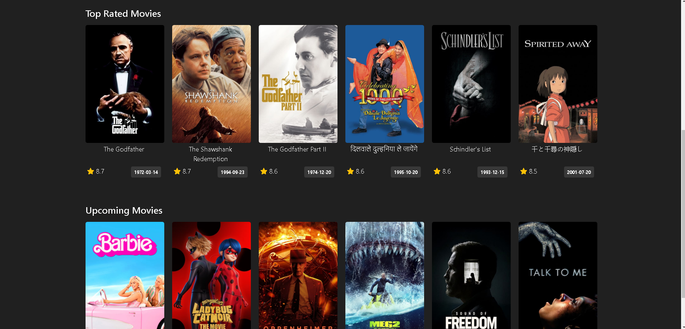
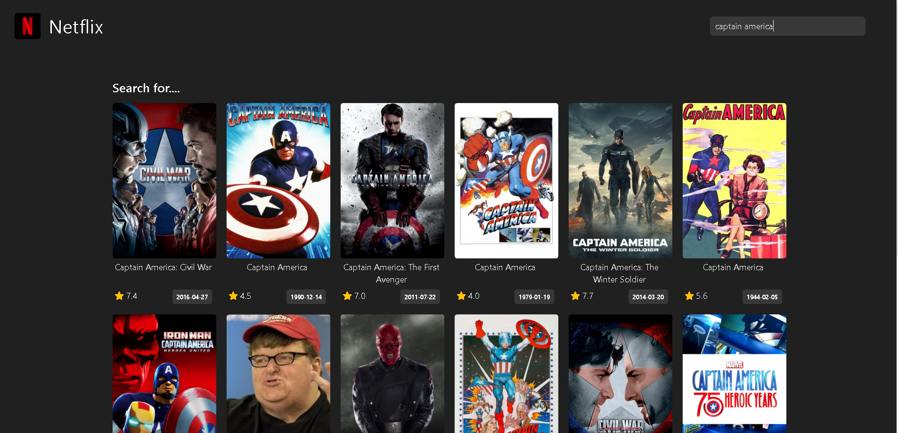

# movies-App

## Description:
This project is a movie website built using The Movie Database (TMDB) API. The site provides users with easy access to various movie information, such as popular, upcoming, and top-rated films.

## Features:
* The homepage lists current popular and upcoming movies with posters and basic details.
  
* Users can search for their favorite movies using the search bar and view relevant results.
 
* Each movie has a detailed page displaying information like the movie title, original title, genres, rating, release date, synopsis, and cast.
 
* Movie pages also showcase trailers and images related to the movie.
 
* Users can find more information about each movie by following links to the TMDB website.
  
* The design is user-friendly and responsive, ensuring smooth performance across different devices.

## Technologies Used:
* HTML, CSS, and JavaScript are primarily used to create the user interface.

* The Fetch API is utilized to exchange data with the TMDB API.

* Bootstrap or another CSS library can be used for responsive design.

# Demo

[You can find the live version](https://sametert.github.io/movies-App/)

### Weekly Trending Movies

### Top Rated and Upcoming Movies

### Search for Movies

